# Git 협업 방법
## 1. 코드 복사 하기.
1.1 ] 교수님 Git 에서 `Code` 클릭 후 아래 `HTTPS` 의 내용을 복사한다. 

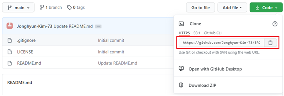

1.2 ] Professional 버전의 파이참에서 `VCS` 탭에서 `Get from Version Control ...` 또는
Community 버전의 파이참에서는 `Git` 탭에서 `Clone ...` 을 클릭한다. 아래 그림은 Professional 
버전의 파이참이다.

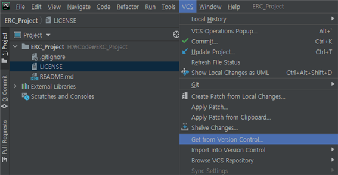

1.3 ] `URL` 칸에 위에서 복사하였던 `HTTPS` 의 내용을 붙여 넣기하고 `Clone` 을 클릭한다.

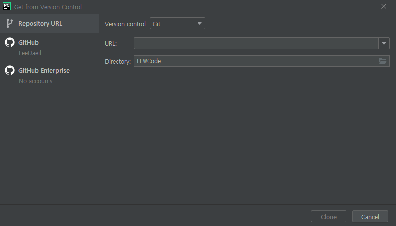

## 2. 파일 작성 하기.

2.1] `Clone` 이 성공적으로 되었다면 아래 그림과 같이 교수님 Git 파일을 받을 수 있다. 파일 작성을 위해서 원하는 폴더 위치에
파일 또는 폴더를 만든다. 이를 시도할때 아래와 같이 Git 에 추가할 것인지 물어보는 창이 나오면 `Add` 눌러 승인을 한다. 

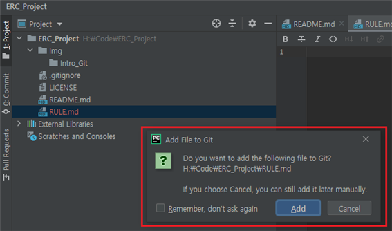

2.2] Git 은 Main Branch 와 작성중인 Branch 의 데이터와 비교하여 수정 및 업데이트된 부분을 보여주는 기능을 가지고있다. 아래 그림과 
같이 추가된 파일에 작업을 하게되면 초록, 파랑, 회색으로 구분된다.

    - 초록은 Main 에는 없고 Local 에만 존재하는 파일로 향후 Main 으로 업로드가 될 파일이다.
    - 파랑은 Main 과 다른 코드 또는 수정된 파일을 의미한다.
    - 회색은 Main 과 Local 의 코드 또는 파일이 동일한 것을 의미한다.

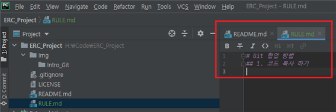

## 3. 파일 업로드 하기. (Commit & Push 과정)

3.1] 코드 작성이 완료되면 Main Branch 로 코드를 업로드해야한다. 이러한 작업을 Commit 이라고 한다.
작성된 코드를 Commit 하기 위해서는 `VCS` 또는 `Git` 탭에서 `Commit` 을 클릭한다.

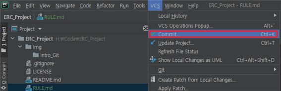

3.2] 아래 그림과 같이 Commit 창이 나타나면, 첫번째로 오른쪽 하단에 톱니 모양을 클릭을 한다. 두번째로 추가적인 창이 나타나면 
코드 수정자의 아이디를 입력하고 창 밖을 클릭하면 해당 창이 꺼지면서 등록이 된다. 세번째로 추가한 목적 및 결과에대하여 작성한다.
마지막으로 Commit 을 눌러준다.

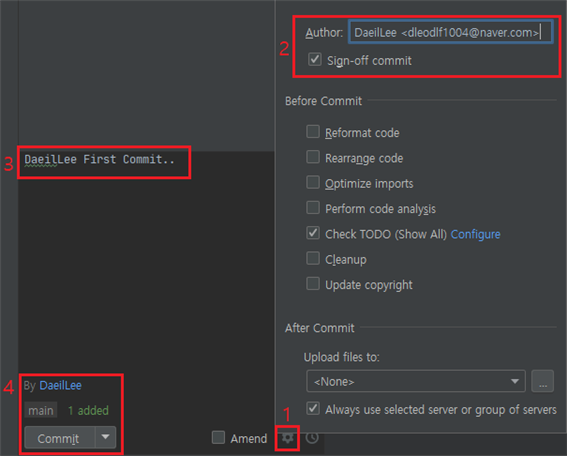

3.3] Commit 된 내용을 확인하기 위해서는 파이참 창 왼쪽 하단의 `Git` 탭을 클릭하면 된다. 해당 창에서 현재 우리의 Branch 가 어디에 
있으면 과거 누가 어떤 부분을 어떠한 목적으로 수정하였는지 확인이 가능하다.  

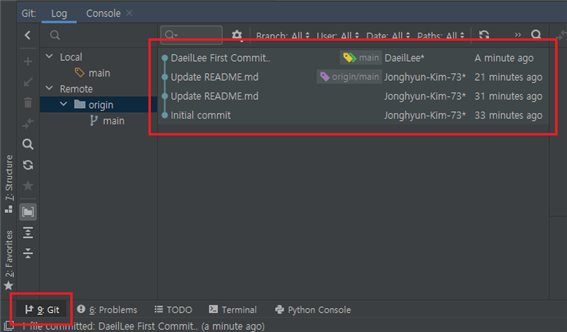

3.4] Commit 후 최종적으로 Main Branch 로 코드를 업로드하기위해서 `Push` 작업을 수행해야한다. 
`VCS` 또는 `Git` 탭에서 `Push` 을 클릭한다.

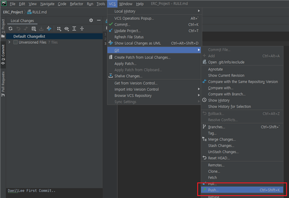

3.5] 최종적으로 Push 를 누르기전까지 수행했던 Commit 과 그 변경사항을 볼 수 있으며, `Push`를 누름으로써 Main Branch 에
업로드 할 수 있다.  

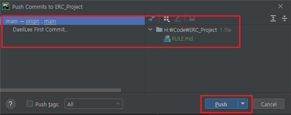

3.6] 처음 시도하는 경우 아래와 같이 로그인을 요청하는 창이 뜰 수 있다.

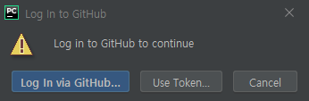

3.7] 최종적으로 완료되면 아래와 같이 색과 Push 성공 메세지를 확인 할 수 있다.

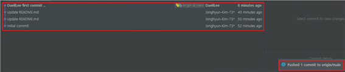

## 4. 파일 업데이트하기 (Update Project 과정)

4.1] 업데이트 방법은 단순하나 버전 충돌 및 관리를 조심해야한다. 업데이느 방법은 `VCS` 또는 `Git` 탭에서 `Update Project` 을 클릭한다.

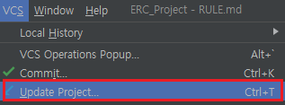

4.2] `Update Project` 를 클릭하면 2가지 선택지가 나온다. 버전 충돌 및 소실을 막기위해서 하나의 py 파일 작업 후 Commit & Push 습관을
가져야한다.
    
    1. 현재 작성 코드와 Main Branch 의 내용과 합친다는 의미이다.
    2. Main Branch가 기준되어 현재 폴더를 업데이트 한다는 의미이다.
    
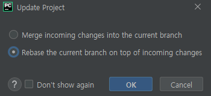

## END